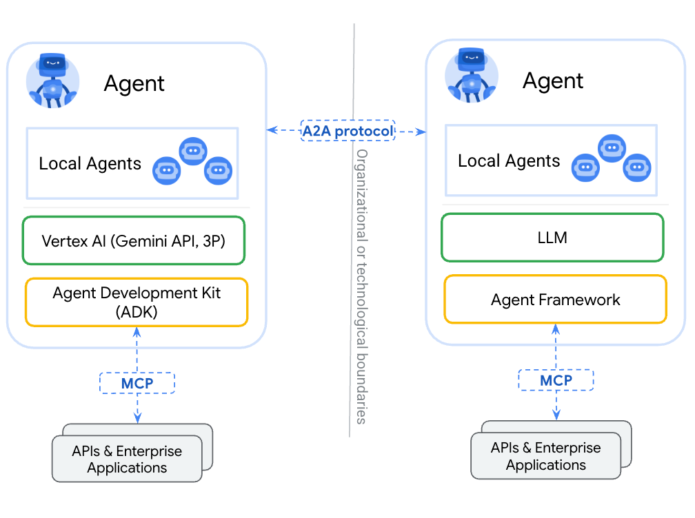
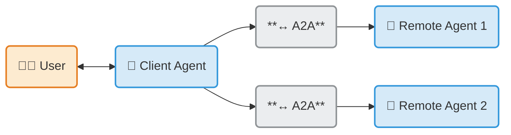

---
hide:
  - toc
---

<!-- markdownlint-disable MD041 -->

  

    
    <h1>Agent2Agent (A2A) Protocol</h1>
  

## What is A2A Protocol?

Welcome to the **official documentation** for the **Agent2Agent (A2A) Protocol** — an open standard for seamless communication and collaboration between AI agents. In a world where agents are built using diverse frameworks and by different vendors, A2A provides the definitive common language for agent interoperability.

!!! abstract ""
    Build with
    **[{class="twemoji lg middle"} ADK](https://google.github.io/adk-docs/)** _(or any framework)_,
    equip with **[{class="twemoji lg middle"} MCP](https://modelcontextprotocol.io)** _(or any tool)_,
    and communicate with
    **{class="twemoji lg middle"} A2A**,
    to remote agents, local agents, and humans.

## Get started with A2A

- :material-play-circle:{ .lg .middle } **Video** Intro in under 8 min

    <iframe class="video-container" src="https://www.youtube.com/embed/Fbr_Solax1w?si=QxPMEEiO5kLr5_0F" title="YouTube video player" frameborder="0" allow="accelerometer; autoplay; clipboard-write; encrypted-media; gyroscope; picture-in-picture; web-share" referrerpolicy="strict-origin-when-cross-origin" allowfullscreen></iframe>

- :material-play-circle:{ .lg .middle } **Course** [DeepLearning.AI](https://deeplearning.ai) - Intro to A2A

    

- :material-book-open:{ .lg .middle } **Read the Introduction**

    Understand the core ideas behind A2A.

    [:octicons-arrow-right-24: What is A2A?](./topics/what-is-a2a.md)

    [:octicons-arrow-right-24: Key Concepts](./topics/key-concepts.md)

- :material-file-document-outline:{ .lg .middle } **Dive into the Specification**

    Explore the detailed technical definition of the A2A protocol.

    [:octicons-arrow-right-24: Protocol Specification](./specification.md)

- :material-application-cog-outline:{ .lg .middle } **Follow the Tutorials**

    Build your first A2A-compliant agent with our step-by-step Python quickstart.

    [:octicons-arrow-right-24: Python Tutorial](./tutorials/python/1-introduction.md)

    [:octicons-arrow-right-24: Walkthrough with AI Agent Frameworks](https://github.com/holtskinner/A2AWalkthrough)

- :material-code-braces:{ .lg .middle } **Explore Code Samples**

    See A2A in action with sample clients, servers, and agent framework integrations.

    [:fontawesome-brands-github: GitHub Samples](https://github.com/a2aproject/a2a-samples)

- :material-code-braces:{ .lg .middle } **Download the Official SDKs**

    [:fontawesome-brands-python: Python](https://github.com/a2aproject/a2a-python)

    [:fontawesome-brands-js: JavaScript](https://github.com/a2aproject/a2a-js)

    [:fontawesome-brands-java: Java](https://github.com/a2aproject/a2a-java)

    [:octicons-code-24: C#/.NET](https://github.com/a2aproject/a2a-dotnet)

    [:fontawesome-brands-golang: Golang](https://github.com/a2aproject/a2a-go)

## How A2A Works with MCP

{width="60%"}
{style="text-align: center; margin-bottom:1em; margin-top:1em;"}

The Model Context Protocol (MCP) and the A2A Protocol are not competitors — they are highly complementary. They solve two different problems and are designed to work together.

- **MCP is for agent-to-tool communication:** it standardizes how an agent connects to its tools, APIs, and resources to get information. See [Model Context Protocol](https://modelcontextprotocol.io/).
- **A2A is for agent-to-agent communication:** as a universal, decentralized standard, A2A lets independent agents — including those using MCP — discover each other, delegate tasks, and share results.

Use MCP to equip an individual agent with the specific tools it needs to do its job (e.g., access to a GitHub repository or a SQL database). Use A2A to let that specialized agent securely collaborate with other agents across different frameworks.

> Equip the agent with MCP; build the agent's network with A2A.

[:octicons-arrow-right-24: A2A and MCP — deeper dive](./topics/a2a-and-mcp.md)

## Key Features

- :material-account-group-outline:{ .lg .middle } **Interoperability**

    Connect agents built on different platforms (LangGraph, CrewAI, Semantic Kernel, custom solutions) to create powerful, composite AI systems.

- :material-lan-connect:{ .lg .middle } **Complex Workflows**

    Enable agents to delegate sub-tasks, exchange information, and coordinate actions to solve complex problems that a single agent cannot.

- :material-shield-key-outline:{ .lg .middle } **Secure & Opaque**

    Agents interact without needing to share internal memory, tools, or proprietary logic, ensuring security and preserving intellectual property.

- :material-puzzle-outline:{ .lg .middle } **Extensible**

    Add capabilities through formal protocol [extensions and custom bindings](./topics/extension-and-binding-governance.md), governed by a tiered promotion process so the core stays stable.

## What A2A Is Not

A2A is a focused protocol. To set expectations, here is what it explicitly does not try to be:

- **Not an agent development kit** like LangGraph, CrewAI, or ADK for building agentic applications. A2A is the communication layer between agents built with any of these.
- **Not a sub-agent or tool-call protocol.** A2A does not specify how an agent talks to its own sub-agents or how it invokes tools — use your framework's native primitives, or MCP, for those.
- **Not a replacement for [MCP](https://modelcontextprotocol.io/).** MCP standardizes agent-to-tool communication; A2A standardizes agent-to-agent communication. They are complementary (see [above](#how-a2a-works-with-mcp)).
- **Not an interactive messaging app** like Slack, Discord, WhatsApp, or Telegram. A2A is a machine-to-machine protocol for autonomous agents.

## Governance & Open Source

A2A was originally developed by Google and donated to the Linux Foundation. It is maintained by a Technical Steering Committee with representatives from AWS, Cisco, Google, IBM Research, Microsoft, Salesforce, SAP, and ServiceNow, and supported by a broad community of [partners](./partners.md).

For details on how the project is run, see [`GOVERNANCE.md`](https://github.com/a2aproject/A2A/blob/main/GOVERNANCE.md) and [`MAINTAINERS.md`](https://github.com/a2aproject/A2A/blob/main/MAINTAINERS.md).

## License

The A2A Protocol is licensed under the [Apache License 2.0](https://github.com/a2aproject/A2A/blob/main/LICENSE) and welcomes [contributions](https://github.com/a2aproject/A2A/blob/main/CONTRIBUTING.md) from the community.
