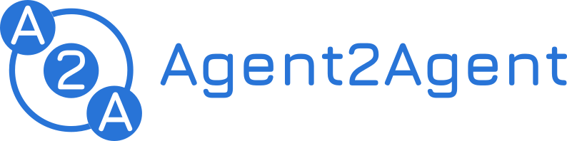
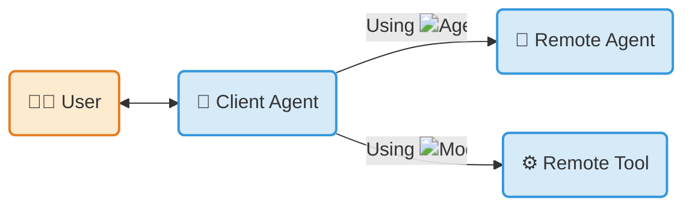

---
hide:
  - toc
  - navigation
  - footer
---

<!-- markdownlint-disable MD041 -->
<div class="hero" markdown="0">
  <div class="centered-logo-text-group">
    <h1></h1>
  </div>

  <div class="hero-tagline-carousel" data-interval="6000">
    <div class="hero-tagline-slides" aria-live="polite">
      <p class="hero-tagline">An open protocol enabling communication and interoperability between opaque agentic applications.</p>
      <p class="hero-tagline">An open standard enabling users to connect agents to tools and data through MCP, and to other agents through A2A.</p>
      <p class="hero-tagline">An open standard enabling developers to expose portable tools through MCP and interoperable agents through A2A.</p>
    </div>
  </div>
</div>

<div class="install-command-container" markdown="1">

**Ship your first A2A agent in ~15 minutes** — install the SDK, then follow the [Python quickstart](./tutorials/python/1-introduction.md).

```bash
pip install a2a-sdk
```

</div>

<div class="hero" markdown="1">

[Start building](./tutorials/python/1-introduction.md){ .md-button .md-button--primary }
[Read the spec](./specification.md){ .md-button }

</div>

## Key features

<div class="feature-flip-cards" markdown="0">
  <div class="feature-flip-card" tabindex="0">
    <span class="feature-flip-hint" data-tooltip="Hover or focus to see details" aria-hidden="true"><svg xmlns="http://www.w3.org/2000/svg" viewBox="0 0 24 24"><path d="M11 9h2V7h-2m1 13c-4.41 0-8-3.59-8-8s3.59-8 8-8 8 3.59 8 8-3.59 8-8 8m0-18A10 10 0 0 0 2 12a10 10 0 0 0 10 10 10 10 0 0 0 10-10A10 10 0 0 0 12 2m-1 15h2v-6h-2z"/></svg></span>
    <div class="feature-flip-card-inner">
      <div class="feature-flip-card-front">
        <span class="feature-flip-card-icon" aria-hidden="true"><svg xmlns="http://www.w3.org/2000/svg" viewBox="0 0 24 24"><path d="M12 5a3.5 3.5 0 0 0-3.5 3.5A3.5 3.5 0 0 0 12 12a3.5 3.5 0 0 0 3.5-3.5A3.5 3.5 0 0 0 12 5m0 2a1.5 1.5 0 0 1 1.5 1.5A1.5 1.5 0 0 1 12 10a1.5 1.5 0 0 1-1.5-1.5A1.5 1.5 0 0 1 12 7M5.5 8A2.5 2.5 0 0 0 3 10.5c0 .94.53 1.75 1.29 2.18.36.2.77.32 1.21.32s.85-.12 1.21-.32c.37-.21.68-.51.91-.87A5.42 5.42 0 0 1 6.5 8.5v-.28c-.3-.14-.64-.22-1-.22m13 0c-.36 0-.7.08-1 .22v.28c0 1.2-.39 2.36-1.12 3.31.12.19.25.34.4.49a2.482 2.482 0 0 0 1.72.7c.44 0 .85-.12 1.21-.32.76-.43 1.29-1.24 1.29-2.18A2.5 2.5 0 0 0 18.5 8M12 14c-2.34 0-7 1.17-7 3.5V19h14v-1.5c0-2.33-4.66-3.5-7-3.5m-7.29.55C2.78 14.78 0 15.76 0 17.5V19h3v-1.93c0-1.01.69-1.85 1.71-2.52m14.58 0c1.02.67 1.71 1.51 1.71 2.52V19h3v-1.5c0-1.74-2.78-2.72-4.71-2.95M12 16c1.53 0 3.24.5 4.23 1H7.77c.99-.5 2.7-1 4.23-1"/></svg></span>
        <strong>Interoperability</strong>
      </div>
      <div class="feature-flip-card-back">
        <p>Connect agents built on different platforms (LangGraph, CrewAI, Semantic Kernel, custom solutions) to create powerful, composite AI systems.</p>
      </div>
    </div>
  </div>
  <div class="feature-flip-card" tabindex="0">
    <span class="feature-flip-hint" data-tooltip="Hover or focus to see details" aria-hidden="true"><svg xmlns="http://www.w3.org/2000/svg" viewBox="0 0 24 24"><path d="M11 9h2V7h-2m1 13c-4.41 0-8-3.59-8-8s3.59-8 8-8 8 3.59 8 8-3.59 8-8 8m0-18A10 10 0 0 0 2 12a10 10 0 0 0 10 10 10 10 0 0 0 10-10A10 10 0 0 0 12 2m-1 15h2v-6h-2z"/></svg></span>
    <div class="feature-flip-card-inner">
      <div class="feature-flip-card-front">
        <span class="feature-flip-card-icon" aria-hidden="true"><svg xmlns="http://www.w3.org/2000/svg" viewBox="0 0 24 24"><path d="M4 1c-1.11 0-2 .89-2 2v4c0 1.11.89 2 2 2H1v2h12V9h-3c1.11 0 2-.89 2-2V3c0-1.11-.89-2-2-2zm0 2h6v4H4zM3 13v7h7v-2H5v-5zm11 0c-1.11 0-2 .89-2 2v4c0 1.11.89 2 2 2h-3v2h12v-2h-3c1.11 0 2-.89 2-2v-4c0-1.11-.89-2-2-2zm0 2h6v4h-6z"/></svg></span>
        <strong>Complex Workflows</strong>
      </div>
      <div class="feature-flip-card-back">
        <p>Enable agents to delegate sub-tasks, exchange information, and coordinate actions to solve complex problems that a single agent cannot.</p>
      </div>
    </div>
  </div>
  <div class="feature-flip-card" tabindex="0">
    <span class="feature-flip-hint" data-tooltip="Hover or focus to see details" aria-hidden="true"><svg xmlns="http://www.w3.org/2000/svg" viewBox="0 0 24 24"><path d="M11 9h2V7h-2m1 13c-4.41 0-8-3.59-8-8s3.59-8 8-8 8 3.59 8 8-3.59 8-8 8m0-18A10 10 0 0 0 2 12a10 10 0 0 0 10 10 10 10 0 0 0 10-10A10 10 0 0 0 12 2m-1 15h2v-6h-2z"/></svg></span>
    <div class="feature-flip-card-inner">
      <div class="feature-flip-card-front">
        <span class="feature-flip-card-icon" aria-hidden="true"><svg xmlns="http://www.w3.org/2000/svg" viewBox="0 0 24 24"><path d="M21 11c0 5.55-3.84 10.74-9 12-5.16-1.26-9-6.45-9-12V5l9-4 9 4zm-9 10c3.75-1 7-5.46 7-9.78V6.3l-7-3.12L5 6.3v4.92C5 15.54 8.25 20 12 21m0-15a3 3 0 0 1 3 3c0 1.31-.83 2.42-2 2.83V14h2v2h-2v2h-2v-6.17A2.99 2.99 0 0 1 9 9a3 3 0 0 1 3-3m0 2a1 1 0 0 0-1 1 1 1 0 0 0 1 1 1 1 0 0 0 1-1 1 1 0 0 0-1-1"/></svg></span>
        <strong>Secure &amp; Opaque</strong>
      </div>
      <div class="feature-flip-card-back">
        <p>Agents interact without needing to share internal memory, tools, or proprietary logic, ensuring security and preserving intellectual property.</p>
      </div>
    </div>
  </div>
  <div class="feature-flip-card" tabindex="0">
    <span class="feature-flip-hint" data-tooltip="Hover or focus to see details" aria-hidden="true"><svg xmlns="http://www.w3.org/2000/svg" viewBox="0 0 24 24"><path d="M11 9h2V7h-2m1 13c-4.41 0-8-3.59-8-8s3.59-8 8-8 8 3.59 8 8-3.59 8-8 8m0-18A10 10 0 0 0 2 12a10 10 0 0 0 10 10 10 10 0 0 0 10-10A10 10 0 0 0 12 2m-1 15h2v-6h-2z"/></svg></span>
    <div class="feature-flip-card-inner">
      <div class="feature-flip-card-front">
        <span class="feature-flip-card-icon" aria-hidden="true"><svg xmlns="http://www.w3.org/2000/svg" viewBox="0 0 24 24"><path d="M22 13.5c0 1.76-1.3 3.22-3 3.46V20a2 2 0 0 1-2 2h-3.8v-.3a2.7 2.7 0 0 0-2.7-2.7c-1.5 0-2.7 1.21-2.7 2.7v.3H4a2 2 0 0 1-2-2v-3.8h.3C3.79 16.2 5 15 5 13.5s-1.21-2.7-2.7-2.7H2V7a2 2 0 0 1 2-2h3.04c.24-1.7 1.7-3 3.46-3s3.22 1.3 3.46 3H17a2 2 0 0 1 2 2v3.04c1.7.24 3 1.7 3 3.46M17 15h1.5a1.5 1.5 0 0 0 1.5-1.5 1.5 1.5 0 0 0-1.5-1.5H17V7h-5V5.5A1.5 1.5 0 0 0 10.5 4 1.5 1.5 0 0 0 9 5.5V7H4v2.12c1.76.68 3 2.38 3 4.38s-1.25 3.7-3 4.38V20h2.12a4.7 4.7 0 0 1 4.38-3c2 0 3.7 1.25 4.38 3H17z"/></svg></span>
        <strong>Extensible</strong>
      </div>
      <div class="feature-flip-card-back">
        <p>Add capabilities through formal protocol <a href="./topics/extension-and-binding-governance/">extensions and custom bindings</a>, governed by a tiered promotion process so the core stays stable.</p>
      </div>
    </div>
  </div>
</div>

## Why A2A matters

The **Agent2Agent (A2A) Protocol** is an open standard for seamless communication and collaboration between AI agents. In a world where agents are built using diverse frameworks and by different vendors, A2A provides the common language for agent interoperability.

??? example "Example: Planning an international trip"

    Consider a user asking an AI assistant to **plan an international trip**. One agent cannot do it alone — it needs specialized agents for flights, hotels, currency, and local tours. Without a shared protocol, each integration is bespoke, fragile, and hard to scale. **A2A lets those agents discover each other, delegate work, and return results** — regardless of who built them or which framework they use.

    ```mermaid
    flowchart TB
        User(🧑‍💻 User) --> Assistant(🤖 AI Assistant)
        Assistant --> FBA(✈️ Flight Agent)
        Assistant --> HRA(🏨 Hotel Agent)
        Assistant --> CCA(💱 Currency Agent)
        Assistant --> LTA(🚌 Tours Agent)
        FBA & HRA & CCA & LTA --> Assistant
        Assistant --> User

        classDef user fill:#fdebd0,stroke:#e67e22,stroke-width:2px
        classDef agent fill:#d6eaf8,stroke:#3498db,stroke-width:2px
        class User user
        class Assistant,FBA,HRA,CCA,LTA agent
    ```

    [:octicons-arrow-right-24: Full scenario & benefits](./topics/what-is-a2a.md)

## How A2A works with MCP

[MCP](https://modelcontextprotocol.io/) and A2A are complementary — not competitors:

- **MCP** — agent ↔ tools, APIs, and data
- **A2A** — agent ↔ agent discovery, delegation, and results

<div style="text-align:center">


```mermaid
flowchart LR
    User(🧑‍💻 User) <--> ClientAgent(🤖 Client Agent)
    RemoteAgent(🤖 Remote Agent)
    RemoteTool(⚙️ Remote Tool)
    ClientAgent -- Using <img src="assets/a2a_logo/icon/color/SVG/a2a_icon_color.svg" alt="Agent2Agent Protocol Logo" height="40" width="40"> --> RemoteAgent
    ClientAgent -- Using <img src="https://modelcontextprotocol.io/mcp.png" alt="Model Context Protocol Logo" height="40" width="40"> --> RemoteTool

    style User fill:#fdebd0,stroke:#e67e22,stroke-width:2px
    style ClientAgent fill:#d6eaf8,stroke:#3498db,stroke-width:2px
    style RemoteAgent fill:#d6eaf8,stroke:#3498db,stroke-width:2px
    style RemoteTool fill:#d6eaf8,stroke:#3498db,stroke-width:2px
```

</div>

[:octicons-arrow-right-24: A2A and MCP — deeper dive](./topics/a2a-and-mcp.md)

## Explore further

<div class="grid cards" markdown>

- :material-book-open:{ .lg .middle } **Read the Introduction**

    Understand the core ideas behind A2A.

    [:octicons-arrow-right-24: What is A2A?](./topics/what-is-a2a.md)

    [:octicons-arrow-right-24: Key Concepts](./topics/key-concepts.md)

- :material-file-document-outline:{ .lg .middle } **Dive into the Specification**

    Explore the detailed technical definition of the A2A protocol.

    [:octicons-arrow-right-24: Protocol Specification](./specification.md)

- :material-application-cog-outline:{ .lg .middle } **Follow the Tutorials**

    Build your first A2A-compliant agent with our step-by-step Python quickstart.

    [:octicons-arrow-right-24: Hands-on Tutorial](./tutorials/python/1-introduction.md)

- :material-code-braces:{ .lg .middle } **Explore Code Samples**

    See A2A in action with sample clients, servers, and agent framework integrations.

    [:fontawesome-brands-github: GitHub Samples](https://github.com/a2aproject/a2a-samples)

- :material-download:{ .lg .middle } **Official SDKs**

    [:fontawesome-brands-python: Python](https://github.com/a2aproject/a2a-python)

    [:fontawesome-brands-js: JavaScript](https://github.com/a2aproject/a2a-js)

    [:fontawesome-brands-java: Java](https://github.com/a2aproject/a2a-java)

    [:material-language-csharp: C#/.NET](https://github.com/a2aproject/a2a-dotnet)

    [:fontawesome-brands-golang: Golang](https://github.com/a2aproject/a2a-go)

    [:fontawesome-brands-rust: Rust](https://github.com/a2aproject/a2a-rs)

- :material-play-circle:{ .lg .middle } **Video** — Intro in under 8 min

    <iframe class="video-container" src="https://www.youtube.com/embed/Fbr_Solax1w?si=QxPMEEiO5kLr5_0F" title="YouTube video player" frameborder="0" allow="accelerometer; autoplay; clipboard-write; encrypted-media; gyroscope; picture-in-picture; web-share" referrerpolicy="strict-origin-when-cross-origin" allowfullscreen></iframe>

- :material-school:{ .lg .middle } **Course** — [DeepLearning.AI](https://deeplearning.ai) Intro to A2A

    [](https://goo.gle/dlai-a2a)

</div>

<div class="trust-band" markdown="0">
  <div class="trust-stats">
    <a class="trust-stat" href="./sdk/">
      <strong>6</strong>
      <span>Official SDKs</span>
    </a>
    <a class="trust-stat" href="./partners/">
      <strong>170+</strong>
      <span>Community partners</span>
    </a>
    <a class="trust-stat" href="https://github.com/a2aproject/A2A/blob/main/LICENSE">
      <strong>Apache 2.0</strong>
      <span>Open source license</span>
    </a>
    <a class="trust-stat" href="https://github.com/a2aproject/A2A/blob/main/GOVERNANCE.md">
      <strong>Linux Foundation</strong>
      <span>Neutral governance</span>
    </a>
  </div>

  <p class="trust-links">
    <a href="https://discord.gg/a2aprotocol">Join the Discord</a>
    ·
    <a href="https://github.com/a2aproject/A2A/blob/main/CONTRIBUTING.md">Contribute</a>
  </p>
</div>
