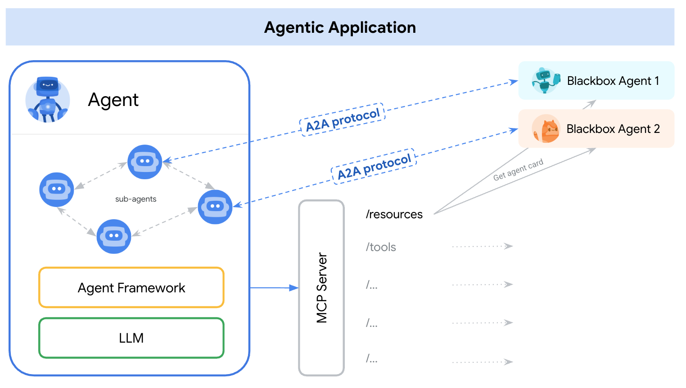

# A2A and MCP: Detailed Comparison

In AI agent development, two key protocol types emerge to facilitate
interoperability. One connects agents to tools and resources. The other enables
agent-to-agent collaboration. The Agent2Agent (A2A) Protocol and the Model
Context Protocol (MCP) address these distinct but highly complementary needs.

 -  **[Model Context Protocol (MCP)](https://modelcontextprotocol.io/)**: This protocol focuses on how an agent interacts with individual tools and resources, enabling an agent to utilize a specific tool, such as a database or an API.
 -  **Agent2Agent (A2A) protocol**: This protocol focuses on how different agents collaborate with each other, enabling agents to work together to achieve a common goal.

Both protocols are crucial for building complex AI systems, and they address
distinct but highly complementary needs.

## Why Different Protocols?

The distinction between A2A and MCP arises from the nature of what an agent
interacts with.

 -  **Tools and resources (MCP domain)**:
    -  **Characteristics:** These are typically primitives with well-defined,
        structured inputs and outputs. They perform specific, often stateless,
        functions. Examples include a calculator, a database query API, or a
        weather lookup service.
    -  **Purpose:** Agents use tools to gather information and perform discrete
        functions.
 -  **Agents (A2A domain)**:
    -  **Characteristics:** These are more autonomous systems. They reason,
        plan, use multiple tools, maintain state over longer interactions, and
        engage in complex, often multi-turn dialogues to achieve novel or
        evolving tasks.
    -  **Purpose:** Agents collaborate with other agents to tackle broader, more
        complex goals.
## Model Context Protocol (MCP)

-  Standardizes how AI models and agents connect to and interact with tools,
        APIs, data sources, and other external resources.
-  Defines a structured way to describe tool capabilities, similar to
        function calling in Large Language Models.
-  Passes inputs to tools and receives structured outputs.
-  Use cases include enabling an LLM to call an external API, allowing an
        agent to query a database, or connecting an agent to a set of predefined
        functions.

## Agent2Agent Protocol (A2A)

-  Standardizes how independent, often opaque, AI agents communicate and
        collaborate with each other as peers.
-  Provides an application-level protocol for agents to discover each other,
        negotiate interaction modalities, manage shared Tasks, and exchange
        conversational context and complex Artifacts.
-  Use cases include a customer service agent delegating an inquiry to a
        billing agent, or a travel agent coordinating with flight, hotel, and
        activity agents.

## How A2A and MCP Complement Each Other

An agentic application might primarily use A2A to communicate with other agents.
Each individual agent internally uses MCP to interact with its specific tools
and resources.

{width="80%"}

_An agentic application might use A2A to communicate with other agents, while each agent internally uses MCP to interact with its specific tools and resources._

### Example Scenario: The Auto Repair Shop

Consider an auto repair shop staffed by autonomous AI agent "mechanics".
These mechanics use special-purpose tools, such as vehicle diagnostic scanners,
repair manuals, and platform lifts, to diagnose and repair problems. The repair
process can involve extensive conversations, research, and interaction with part
suppliers.

-   **Customer interaction (user-to-agent using A2A)**: A customer (or their
    primary assistant agent) uses A2A to communicate with the "Shop Manager"
    agent.

    For example, the customer might say, "My car is making a rattling noise".
-   **Multi-turn diagnostic conversation (agent-to-agent using A2A)**: The Shop
    Manager agent uses A2A for a multi-turn diagnostic conversation.

    For example,
    the Manager might ask, "Can you send a video of the noise?" or "I see
    some fluid leaking. How long has this been happening?".
-   **Internal tool usage (agent-to-tool using MCP)**: The Mechanic agent,
    assigned the task by the Shop Manager, needs to diagnose the issue. The
    Mechanic agent uses MCP to interact with its specialized tools.

    For example:
    -   MCP call to a "Vehicle Diagnostic Scanner" tool:
        `scan_vehicle_for_error_codes(vehicle_id='XYZ123')`
    -   MCP call to a "Repair Manual Database" tool:
        `get_repair_procedure(error_code='P0300', vehicle_make='Toyota',
        vehicle_model='Camry')`
    -   MCP call to a "Platform Lift" tool: `raise_platform(height_meters=2)`
-   **Supplier interaction (agent-to-agent using A2A)**: The Mechanic agent
    determines that a specific part is needed. The Mechanic agent uses A2A to
    communicate with a "Parts Supplier" agent to order a part.

    For example, the
    Mechanic agent might ask, "Do you have part #12345 in stock for a Toyota Camry 2018?"
-   **Order processing (agent-to-agent using A2A)**: The Parts Supplier agent,
    which is also an A2A-compliant system, responds, potentially leading to an
    order.

In this example:

-   A2A facilitates the higher-level, conversational, and task-oriented
    interactions between the customer and the shop, and between the shop's
    agents and external supplier agents.
-   MCP enables the mechanic agent to use its specific, structured tools to
    perform its diagnostic and repair functions.

An A2A server could expose some of its skills as MCP-compatible resources.
However, A2A's primary strength lies in its support for more flexible, stateful,
and collaborative interactions. These interactions go beyond a typical tool
invocation. A2A focuses on agents partnering on tasks, whereas MCP focuses on
agents using capabilities.

## Representing A2A Agents as MCP Resources

An A2A Server (a remote agent) could expose some of its skills as MCP-compatible resources, especially if those skills are well-defined and can be invoked in a more tool-like, stateless manner. In such a case, another agent might "discover" this A2A agent's specific skill through an MCP-style tool description (perhaps derived from its Agent Card).

However, the primary strength of A2A lies in its support for more flexible, stateful, and collaborative interactions that go beyond typical tool invocation. A2A is about agents *partnering* on tasks, while MCP is more about agents *using* capabilities.

By leveraging both A2A for inter-agent collaboration and MCP for tool integration, developers can build more powerful, flexible, and interoperable AI systems.

