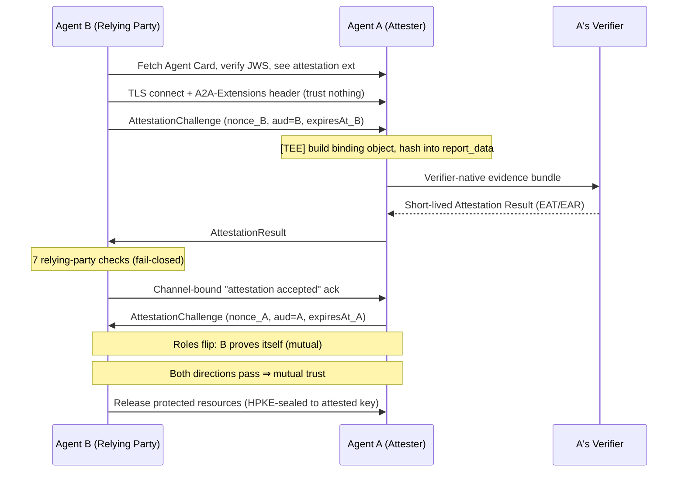

# Hardware-Rooted Remote Attestation Extension (Design Draft)

!!! warning "Non-normative design draft"
    This document is a **non-normative design draft** for a proposed A2A
    extension. It describes an end-to-end flow, security considerations, and an
    example transcript so reviewers have something concrete to evaluate. It does
    **not** add core types or enums, and it does **not** change the core
    protocol. The normative specification and reference implementation are
    expected to live in a separate `experimental-ext-*` repository once the
    proposal secures maintainer sponsorship, per the
    [Extension and Binding Governance](extension-and-binding-governance.md)
    process.

    Tracking issue:
    [#2078](https://github.com/a2aproject/A2A/issues/2078).

## Summary

This extension lets two agents each prove to the other that they are genuine,
unmodified code running inside a verified Trusted Execution Environment (TEE),
with the proof **bound to the live channel** and to the agent's **published
Agent Card identity**. It is built on the IETF RATS architecture
([RFC 9334](https://www.rfc-editor.org/rfc/rfc9334)) and reuses existing
verifiers (Microsoft Azure Attestation, Google Confidential Space, Intel Trust
Authority). It introduces **no new verifier** and **no core-protocol change**.

The extension is **opt-in** and **data-only** in the sense that it composes with
the existing A2A trust stack — Agent Card JWS signatures (§8.4), identity, and
authorization efforts — rather than forking them. An agent that ignores the
extension still interoperates.

## Motivation

A2A today provides transport security (HTTPS/TLS) and agent discovery (Agent
Cards signed with JWS). Together these answer *"who signed the card"* and *"is
the transport encrypted"* — but not *"what code is actually running on the other
end right now?"*

- **Agent Card signatures prove key custody, not runtime integrity.** A valid
    card signature shows a key signed the card; it says nothing about the code
    executing behind that key. An attacker who controls the host, the operator,
    or a co-tenant can present a perfectly valid card while running modified
    code, a swapped model, or a debugger-attached process.
- **TLS secures the pipe, not the peer.** Transport security proves the channel
    is encrypted to *some* endpoint; it does not prove that endpoint is a
    genuine, measured agent, and it can break silently across L7-terminating
    proxies.
- **Existing software trust work stops at the software layer.**
    Identity/authorization/reputation efforts are rooted in software keys,
    registries, and self-reported posture. They answer *who* and *what is
    authorized* — none produces or verifies a hardware quote, measures the
    runtime, or binds a live channel to a TEE.

The missing primitive is a **hardware root of trust**: verifier-appraised TEE
evidence (Intel TDX / AMD SEV-SNP / SGX, plus optional GPU confidential
computing), joined to the agent's published identity and bound into the live
channel. This removes the host, hypervisor, and operator from the trusted
computing base — a gap the software layers cannot close on their own.

## Scope

**In scope.** Proving **runtime measurement freshness for a live channel**: the
code identity and TEE posture of the peer on the other end of *this* session,
right now, cryptographically bound to the channel and to the peer's Agent Card
identity.

**Out of scope (explicitly not decided by this extension).**

- **Authorization policy** — what an attested peer is allowed to do.
- **Reputation and historical trust** — the agent's past behavior or standing.
- **Identity issuance** — the extension consumes the existing Agent Card
    identity; it does not mint or manage identities.

These layers can **consume** the runtime proof this extension produces (see
[Durable attestation result reference](#durable-attestation-result-reference)),
but they are deliberately kept separate so the extension stays focused and does
not force A2A to bless a particular TEE vendor, authorization model, or
reputation system.

## RATS roles and topology

This extension uses the roles defined in
[RFC 9334](https://www.rfc-editor.org/rfc/rfc9334):

- **Attester** — produces evidence (the agent's TEE).
- **Verifier** — appraises evidence against reference values and policy, and
    issues an Attestation Result (EAT/EAR).
- **Relying Party (RP)** — consumes the Attestation Result to make a trust
    decision (the peer agent).

**Topology.** The **Passport model** is recommended: each agent obtains a token
from *its own* verifier and presents that token to the peer. This keeps raw
evidence off the peer's path and off the relying party's hot path, and lets each
agent use the verifier that supports its hardware.

## Extension declaration and discovery

The extension is identified by a versioned URI and declared in the Agent Card
under `capabilities.extensions[]`, following the standard
[Extensions](extensions.md) mechanism.

While in experimental status, the extension is identified by its GitHub repo
tree URL (the same convention used by other `experimental-ext-*` extensions):
`https://github.com/a2aproject/experimental-ext-hardware-attestation/tree/main/v1`.
On graduation to official status it would move to the reserved official
namespace `https://a2a-protocol.org/extensions/hardware-attestation/v1` (see
[Extension and Binding Governance](extension-and-binding-governance.md)).

`acceptedTeeTypes` is an **open, policy-driven set**, not a fixed enum. The
values below are the mainstream x86 server TEEs; other attestable TEEs (for
example `cca` for Arm CCA Realms, `nitro` for AWS Nitro Enclaves, or
`secure-execution` for IBM Secure Execution) are equally valid where the
relying party's policy accepts them. GPU confidential computing is handled
separately as the [composite CPU + GPU](#composite-cpu--gpu-attestation-optional)
case.

```json
{
  "name": "Confidential Analytics Agent",
  "version": "1.0.0",
  "url": "https://example.com/agents/analytics",
  "capabilities": {
    "streaming": true,
    "extensions": [
      {
        "uri": "https://github.com/a2aproject/experimental-ext-hardware-attestation/tree/main/v1",
        "description": "Hardware-rooted mutual remote attestation (RATS).",
        "required": false,
        "params": {
          "acceptedTeeTypes": ["tdx", "sev-snp", "sgx"],
          "channelBinding": "tls-exporter",
          "verifierHints": [
            {
              "iss": "https://sharedeus.eus.attest.azure.net"
            }
          ],
          "policyRef": "https://example.com/agents/analytics/appraisal-policy"
        }
      }
    ]
  }
}
```

The `params` are discovery aids: a relying party never derives trust from them —
it appraises against its **own** pinned policy (see
[Security considerations](#security-considerations)). One field,
`verifierHints`, is **required** when the extension is advertised (so the peer
can fail closed early); the rest are advisory.

### `params` reference

| Field | Type | Meaning |
| :--- | :--- | :--- |
| `acceptedTeeTypes` | `string[]` | Open, policy-driven list of TEE types the agent can attest with (e.g., `tdx`, `sev-snp`, `sgx`, `cca`, `nitro`, `secure-execution`). Not a fixed enum. |
| `channelBinding` | `string` | Method used to bind the proof to the live connection. `tls-exporter` uses an [RFC 9266](https://www.rfc-editor.org/rfc/rfc9266) TLS Exporter value that both ends derive independently. |
| `verifierHints` | `object[]` | **Required when this extension is advertised.** Declares which verifier(s) sign *this* agent's own tokens, so a peer can fail closed at discovery if none are on its pinned allow-list. Each entry has `iss` (the verifier's issuer id). Non-authoritative for the appraisal decision: the relying party resolves signing keys from its **own pinned anchor** (via the pinned `iss`), never from the card. |
| `policyRef` | `string` (URL) | Reference to the agent's published appraisal policy. Informational context only. |

- **`acceptedTeeTypes` — a hint, not a gate on the discovering agent.** A peer
    does **not** need to run in any of these TEE types to discover this card,
    talk to the agent, or even require and verify *this* agent's proof —
    verifying a proof needs no TEE. The list only constrains a peer in the
    direction where that peer must **produce** evidence (mutual mode): if the
    peer attests, its TEE type must be one this agent's policy accepts. Whether
    a peer must attest at all is decided by the relying party for that
    direction, not by this list.

- **`channelBinding` — tie the proof to *this* connection.** The bound value
    (e.g., the `tls-exporter` secret) is folded into the binding object and
    hashed into the quote's `report_data`. Relying-party
    [check 4](#the-seven-relying-party-checks) confirms it matches the live
    channel, defeating relay and man-in-the-middle reuse. Where an L7 proxy
    terminates TLS, an inner-channel (HPKE) mode can carry the binding
    end-to-end.
- **`verifierHints` — required, but still not "who to trust."** Each agent
    **MUST** advertise the verifier(s) that sign its **own** tokens whenever it
    advertises this extension. In mutual mode the roles flip, and **B's verifier
    is often different from A's** (different cloud/hardware ⇒ Azure MAA vs. Intel
    Trust Authority vs. Confidential Space), so each side publishes its own. This
    lets the other party check the issuer against its pinned allow-list and
    **fail closed at discovery** instead of after a wasted handshake. It stays
    non-authoritative for the decision: verification still uses the relying
    party's pinned anchors ([checks 1–2](#the-seven-relying-party-checks)) and
    the token's own `issuer`/`verifierKid`, never the card value — preserving the
    defense against verifier substitution.
- **`policyRef` — transparency, not delegation.** It points to the kind of
    content in the [AppraisalPolicy](#appraisalpolicy-relying-party-local) object
    (accepted verifiers, reference measurements, token TTLs, stale-token action).
    The relying party still enforces its **own** local policy; it does not import
    and execute a peer-supplied policy.

All four are advertised in the Agent Card as discovery aids. A dishonest card
cannot weaken a relying party, because trust is derived from the relying party's
own pinned policy and the seven checks — never from these `params`.

## Activation

Activation follows the standard extension negotiation: a client requests the
extension by listing its URI in the `A2A-Extensions` HTTP header, and the agent
echoes the activated extension in its response. Challenge and result data flow
in `Message.metadata[extensionURI]`; no new RPC methods or core types are
required.

## Data objects

These schemas are illustrative for the design draft; the normative schema will
be fixed in the experimental extension repository.

### AttestationChallenge (relying party → peer)

The challenge exists to cause a fresh proof that is bound to the intended
relying party and the current connection. It deliberately carries no appraisal
policy; accepted TEE types, required claims, trusted verifiers, and reference
measurements remain in the relying party's local policy.

```jsonc
{
    "nonce": "<>=128-bit single-use random value>",
    "aud": "<stable relying-party identifier>",
    "expiresAt": "<RFC 3339 UTC timestamp>"
}
```

All three fields are required. `nonce` provides freshness and replay
protection, `aud` prevents a proof made for one relying party from being reused
with another, and `expiresAt` bounds the challenge lifetime. The relying party
must track each nonce, accept it at most once, and reject it after `expiresAt`.
Both parties derive the `tls-exporter` value independently from the live TLS
connection using parameters fixed by this extension; it is not transmitted in
the challenge. The attester binds `nonce`, `aud`, and `expiresAt`, together with
the locally derived channel binding and agent identity values, into the quote's
`report_data`.

### Raw evidence bundle (attester → its verifier)

After receiving the challenge, the attester sends a **verifier-native evidence
bundle** to its own verifier. This is not an A2A wire object and this extension
does not define a universal schema for it: Azure Attestation, Confidential
Space, Intel Trust Authority, and other verifiers each define their own API and
evidence format. The bundle never goes to the peer.

Conceptually, the bundle contains:

- The hardware-signed quote or attestation report. Its signed body contains the
    TEE's native measurements, security state, and `report_data`.
- The binding object so the verifier can recompute
    `SHA-384(JCS(bindingObject))` and confirm that it equals `report_data` in the
    signed quote. The object includes the challenge (`nonce`, `aud`,
    `expiresAt`), the locally derived channel binding, the in-TEE identity-key
    hash, and the Agent Card fingerprint.
- Endorsements or references needed to validate the quote, such as the
    hardware-vendor certificate chain and TCB information. A verifier may fetch
    these itself instead of receiving them from the attester.
- An optional measured-boot or runtime event log used to explain how extensible
    measurement registers reached their quoted values.
- Optional composite evidence from an attached confidential GPU, when required
    by policy.

The exact native fields differ by TEE family:

| TEE family | Representative hardware-attested state |
| :--- | :--- |
| Intel TDX | Initial trusted-domain image/configuration (`MRTD`), runtime-extendable measurements (`RTMR[0..3]`), TCB/security version, and security attributes. |
| AMD SEV-SNP | Initial guest launch measurement, guest policy, reported TCB version, privilege level, and security state such as whether debugging or migration is permitted. |
| Intel SGX | Enclave and signer measurements, product/security version, enclave attributes, and `report_data`. |
| Arm CCA | Initial Realm measurement, extensible Realm measurements, platform security state, and challenge/binding data. |
| AWS Nitro Enclaves | Enclave image and signing-certificate measurements in the signed attestation document, plus bound user data, public key, or nonce. |
| IBM Secure Execution | Protected guest image/configuration and platform security state, according to the verifier profile. |

Hardware attestation does **not** automatically measure every file or every
runtime action. The launch measurement normally covers the initial TEE image
and configuration. Model, toolset, policy, or application-binary hashes are
trusted only when the workload deliberately measures them into a quoted
runtime register/event log, or cryptographically binds them through
`report_data` under a verifier policy that understands that binding. A loose,
unsigned `modelHash` or `toolsetHash` sent next to a quote is not evidence.

Similarly, `nonce`, `aud`, `expiresAt`, the TLS exporter, the identity-key hash,
and the Agent Card fingerprint are **bound context**, not executable-code
measurements. Their inclusion in `report_data` proves that this measured TEE
created the proof for this challenge, relying party, identity, card, and live
channel.

### AttestationResult (peer → relying party)

```jsonc
{
  "format": "EAT",              // or "EAR"
  "jwt": "<verifier-signed EAT/EAR>",
  "verifierKid": "<key id>",
  "issuer": "<verifier issuer URL>",
  "reportDataBinding": "SHA-384(JCS(bindingObject))"
}
```

### AppraisalPolicy (relying party, local)

```jsonc
{
  "verifiers": [
    {
      "issuer": "https://sharedeus.eus.attest.azure.net",
      "jwksUrl": "https://sharedeus.eus.attest.azure.net/certs",
      "rootCert": "<pinned>"
    }
  ],
  "acceptedTeeTypes": ["tdx", "sev-snp"],
  "referenceValues": {
    "mrtd": ["<digest>"],
    "toolsetHash": ["<digest>"],
    "modelHash": ["<digest>"]
  },
  "maxTokenTtlSeconds": 300,
  "staleAction": "hard_fail",
  "requireGpuAttestation": true
}
```

## End-to-end flow

Agent B wants to talk to Agent A, and B's policy requires hardware proof:

1. **Discover.** B fetches A's Agent Card, verifies its JWS signature, and sees
    the attestation extension advertised. If B's policy requires attestation and
    the card doesn't offer it, B **stops** — no downgrade.
2. **Connect (trust nothing yet).** B opens a TLS connection and signals it
    wants the attestation extension. B sends nothing sensitive — the endpoint is
    untrusted until it proves itself (fail-closed).
3. **Challenge.** B sends a fresh single-use `nonce`, its stable identifier as
    `aud`, and a short `expiresAt` deadline. B records the challenge and this
    connection's locally derived `tls-exporter` fingerprint.
4. **Prove (A's side).** Inside its TEE, A builds the **binding object** (B's
    nonce, audience, challenge expiry, channel fingerprint, A's in-TEE
    identity-key hash, and card fingerprint), hashes it into `report_data`, and
    has the hardware sign a quote.
5. **Appraise.** A sends the verifier-native evidence bundle (raw quote,
    binding object, and any required endorsements or event log) to **its own**
    verifier. The verifier validates the quote and appraises its measurements
    and bound context before returning a short-lived signed Attestation Result.
    A forwards that token to B. To initiate the reverse direction, A also sends
    its own complete AttestationChallenge (`nonce_A`, `aud = A`, and
    `expiresAt_A`).
6. **Verify.** B runs the [seven relying-party checks](#the-seven-relying-party-checks).
    Any failure ⇒ B tears down and releases nothing.
7. **Make it mutual.** Roles flip — A challenges B, B proves itself the same
    way, A verifies. When **both** directions pass, trust is mutual.
8. **Release and transact.** Only now does the relying party release protected
    resources — task data, capability grants, or a payload key HPKE-sealed to the
    peer's attested identity key (so only the genuine attested agent can open
    it). Tokens keep refreshing during the session; if the runtime changes, the
    session fails closed.



## The seven relying-party checks

Each agent runs these checks on the other's Attestation Result. Every check
**compares two values** — one that comes from the peer's proof, and one the
relying party already holds on its own — and they must match (or, for check 1,
validate). **All seven must pass, or the session fails closed.**

1. **Is the token really signed by a verifier I trust?**
    - **What's compared:** a digital signature against a public key.
    - **From the peer:** the signed token (`jwt`) in the `AttestationResult`; its
        `verifierKid` just says which key was used.
    - **The relying party holds:** the verifier's public key, taken from its
        **own pinned** policy (`jwksUrl` / `rootCert`) — never a key the peer or
        card points to.
    - **Result:** passes only if the pinned key validates the signature. If not,
        nothing else in the token may be trusted and the session stops.

2. **Was it signed by a verifier on my allow-list?**
    - **What's compared:** who signed the token against my list of trusted
        signers.
    - **From the peer:** the `issuer` value read from *inside* the now
        signature-verified token.
    - **The relying party holds:** the `verifiers[].issuer` allow-list in its own
        local policy.
    - **Result:** must be an exact match. A real signature from a verifier that
        isn't on the list is still rejected — this stops the peer from picking its
        own verifier.

3. **Was this proof made for me, on this connection, by this identity?**
    - **What's compared:** two digests that must be equal.
    - **The relying party builds one itself** from values it already holds: its
        own `nonce`, its own `aud`, the `expiresAt` it set, the `tls-exporter` it
        derives from this live TLS session, the attested identity-key hash, and
        the fingerprint of the Agent Card it fetched — then hashes them with
        `SHA-384(JCS(...))`.
    - **From the peer:** the `report_data` value the verifier confirmed was baked
        into the hardware quote (read from the signed `jwt`, **not** the unsigned
        outer `reportDataBinding`).
    - **Result:** passes when the two digests are identical. If any bound field
        (nonce, audience, channel, identity, or card) differs, the hashes won't
        match and it fails closed. (Both sides must serialize the object the same
        way — [RFC 8785 JCS](https://www.rfc-editor.org/rfc/rfc8785).)

4. **Is the proof tied to *this* live connection?**
    - **What's compared:** two `tls-exporter` values (each folded into the
        digests of check 3).
    - **From the peer:** the exporter the attester derived from *its* end of the
        TLS session and baked into the quote.
    - **The relying party holds:** the exporter it derives from *its own* end of
        the same TLS session.
    - **Result:** neither value is ever sent on the wire; both ends compute it
        independently ([RFC 9266](https://www.rfc-editor.org/rfc/rfc9266)). Same
        session ⇒ identical value ⇒ match. A relay or man-in-the-middle sits on a
        *different* session, gets a different value, and fails closed. (Where an
        L7 proxy terminates TLS, an inner-channel HPKE binding carries the value
        end-to-end instead.)

5. **Is the measured TEE the same agent whose card I'm talking to?**
    - **What's compared:** two public keys (or key hashes).
    - **From the peer:** the `identity_key` the TEE proved it holds, read from
        inside the signed token (and bound into the quote via check 3).
    - **The relying party holds:** the public key in the peer's Agent Card, which
        it fetched and whose JWS signature (§8.4) it verified during discovery.
    - **Result:** passes when the two are equal. A mismatch means a valid card was
        paired with an unrelated (or unmeasured) runtime, and the session fails
        closed.

6. **Is the running code a version I approve?**
    - **What's compared:** the TEE's code measurements against my approved list.
    - **From the peer:** the measurement registers (`MRTD`/launch measurement,
        `RTMR[0..3]`, `MRENCLAVE`, TCB/SVN, security attributes) from the hardware
        quote — separate from `report_data`. In the Passport flow the **verifier**
        reads these and returns a yes/no verdict; otherwise the verifier lists
        them as claims inside the signed token. Either way the raw quote never
        reaches the relying party.
    - **The relying party holds:** the approved digests in `referenceValues`, and
        the accepted TEE families in `acceptedTeeTypes`.
    - **Result:** passes when every measured register value is in the approved
        set and the TEE family is accepted.

7. **Is the proof fresh, for me, and not expired?** Three quick comparisons, all
    against state the relying party already holds:
    - **Nonce:** the `nonce` in the proof must be one the relying party issued
        and hasn't used yet. It's consumed on acceptance, so a replayed proof with
        an already-seen nonce fails — this defeats replay.
    - **Audience:** the `aud` in the proof must equal the relying party's **own**
        identifier (the value it put in its challenge), so a proof made for
        someone else can't be redirected here.
    - **Expiry:** the current time must be within **both** the challenge
        `expiresAt` the relying party set **and** the token's own lifetime
        (`maxTokenTtlSeconds`). Past either one ⇒ stale ⇒ fail closed, which
        forces periodic re-attestation.

## Failure and downgrade behavior

- **Fail-closed by default.** If any of the seven checks fails, the relying
    party stops immediately, processes nothing, releases no task data or grants,
    and returns a structural "rejected" error that does not leak policy or
    reference values.
- **No silent downgrade.** If a relying party's policy requires attestation and
    the peer does not offer it (or cannot attest in a required direction), the
    relying party does not lower its bar. Its **own** policy decides whether to
    accept a one-way/identity-only session for low-stakes work or to fail closed.
- **Freshness / re-attestation.** Tokens are short-lived (default ≤ 300 s). Each
    side re-proves on the same bound channel before its token expires. If a
    runtime measurement changes mid-session (new tool/model loaded, VM migrated,
    debugger attached) and the new measurement is not approved, the peer tears
    down.
- **Verifier unreachable.** The default rule is to **stop** rather than continue
    on stale trust.

Mixed fleets interoperate: **verifying** a proof needs no TEE (it is only
EAT/EAR signature + policy checks), so a non-TEE agent can still demand and
verify attestation from a TEE peer; only **producing** evidence needs a TEE.

## Durable attestation result reference

While the raw quote is session-local, the flow produces a small, durable
artifact that audits and downstream layers (identity, authorization, evidence
envelopes) can bind to **after** the channel is gone:

```jsonc
{
  "attestation_result_ref": "<opaque id / hash of the Attestation Result>",
  "subject_agent": {
    "identity_key_hash": "<hash of the attested in-TEE identity key>",
    "agent_card_uri": "<URL of the subject's Agent Card>",
    "agent_card_fingerprint": "<digest>"
  },
  "relying_party_id": "<id of the agent that appraised this proof>",
  "runtime_measurement_digest": "<digest>",
  "channel_binding_digest": "<digest of tls-exporter>",
  "policy_ref": "<appraisal policy id>",
  "issued_at": "<timestamp>",
  "expires_at": "<timestamp>",
  "verifier_id": "<verifier issuer URL>"
}
```

The **`subject_agent`** block answers *which agent this attestation is for*: the
`identity_key_hash` is the attested in-TEE identity key (the value bound by
[check 5](#the-seven-relying-party-checks)), giving a directly resolvable subject
rather than a bare digest; `agent_card_uri` lets a consumer fetch and re-verify
the card, and `agent_card_fingerprint` pins the exact card content. Because a
mutual session produces **two** results (one per direction), **`relying_party_id`**
records which side appraised this one, disambiguating the two artifacts.

This keeps the extension focused on runtime measurement while giving other trust
layers a concrete, verifiable input to reference. The runtime proof becomes one
signed input into a larger trust decision rather than the identity layer itself.

## Security considerations

- **Trust anchors are local.** The relying party accepts Attestation Results
    **only** from verifiers on its own pinned allow-list (check 2). The peer
    never selects the verifier. This is the core defense against verifier
    substitution.
- **Identity↔TEE join.** Check 5 binds the attested `identity_key` to the Agent
    Card key, preventing an attacker from pairing a valid card with an unrelated
    (or unmeasured) runtime.
- **Channel binding.** `tls-exporter` (check 4) binds the proof to the live
    session, defeating relay/man-in-the-middle reuse across L7-terminating
    proxies. Where a proxy terminates TLS, an inner-channel (HPKE) mode can carry
    the binding end-to-end.
- **Freshness.** The relying-party nonce, `aud`, and short token TTLs (check 7)
    plus re-attestation defeat replay and stale-trust ("was fine a minute ago")
    attacks.
- **Evidence confidentiality.** The Passport model plus selective disclosure
    keeps raw evidence off the peer path; the relying party never handles the
    peer's raw quote and never exposes its own reference values.
- **Per-agent vs. central verifier.** Security rests on **pinning +
    fail-closed**, not on centralization. A pinned allow-list *may* name a single
    shared verifier within one trust domain, but mandating one global central
    verifier is discouraged: it concentrates failure and compromise, limits
    hardware coverage, and rebuilds a central authority the design avoids.

## Composite CPU + GPU attestation (optional)

!!! note "Deferred — to be specified later"
    For agents that run models on a confidential-computing GPU, the CPU TEE
    alone is insufficient: a CPU-only proof says nothing about the accelerator
    that actually holds the model weights, KV-cache, and prompt/response data.
    A future revision will describe how a **GPU confidential-computing
    attestation** is added to the evidence bundle and cryptographically joined
    to the CPU TEE proof (same-nonce binding), and how the seven relying-party
    checks extend to cover it. This section is intentionally left as a
    placeholder for now.


## Relationship to other proposals

This extension proves **runtime measurement for a live channel**. It is designed
to **compose** with — not replace — identity, authorization, reputation, and
evidence-envelope work, which can consume the
[durable attestation result reference](#durable-attestation-result-reference)
as one signed input. Multi-hop delegation and provenance concerns are
intentionally **out of scope** here and are expected to layer on top as separate
extensions that depend on this one for the attestation handshake.

## Open questions

- Exact canonicalization rule for the binding object
    ([RFC 8785 JCS](https://www.rfc-editor.org/rfc/rfc8785)) and `report_data`
    derivation.
- Wire format for challenge/result carried in `Message.metadata` versus
    dedicated headers.
- Whether any normative hooks (e.g., a security-scheme arm or an
    attestation-required task substate) are ever desired, or whether the
    extension remains fully data-only.
- Offline verification availability differs across clouds (e.g., AMD SEV-SNP
    supports offline chain verification to the AMD root, while Azure TDX behind
    the Hyper-V paravisor requires Azure MAA). The "no new verifier" goal holds,
    but the offline path is not uniformly available.

## References

- [RFC 9334 — Remote ATtestation procedureS (RATS) Architecture](https://www.rfc-editor.org/rfc/rfc9334)
- [RFC 8785 — JSON Canonicalization Scheme (JCS)](https://www.rfc-editor.org/rfc/rfc8785)
- [A2A Extensions](extensions.md)
- [Extension and Binding Governance](extension-and-binding-governance.md)
- [Tracking issue #2078](https://github.com/a2aproject/A2A/issues/2078)
